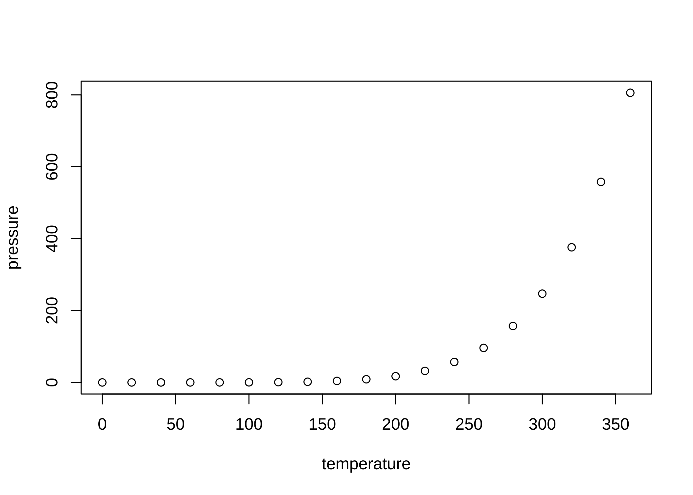

<!-- README.md is generated from README.Rmd. Please edit that file -->

# zvplot

<!-- badges: start -->
<!-- badges: end -->

## Overview

`{zvplot}` is a set of tools for creating and exporting graphics in R
that match the theme of [zakvarty.com](https://www.zakvarty.com).

The package provides extensions to `ggplot2`, as well as colour
definitions and helper functions more general plotting tasks in R.

## Installation

`{zvplot}` is not available on CRAN. You can install `zvplot` directly
from [GitHub](https://github.com/) with the following code:

``` r
# install.packages("devtools")
devtools::install_github("zakvarty/zvplot")
```

### Fonts

The default fonts for plot body and title are Oscar and Oxygen.

Further details on how to install these locally will be added shortly.

### Usage

Some elements of `zvplot` extend `ggplot2` functionality. If you intend
to use these, ensure that you call `library(ggplot2)` or
`library(tidyverse)` before `library(zvplot)`.

### Example 1

This is a basic example which shows you how to solve a common problem:

``` r
library(zvplot)
zvplot::theme_zv()
#> [1] "This is a placeholder function"
```

<!-- You'll still need to render `README.Rmd` regularly, to keep `README.md` up-to-date. `devtools::build_readme()` is handy for this. You could also use GitHub Actions to re-render `README.Rmd` every time you push. An example workflow can be found here: <https://github.com/r-lib/actions/tree/v1/examples>.

You can also embed plots, for example:



In that case, don't forget to commit and push the resulting figure files, so they display on GitHub and CRAN.

-->
